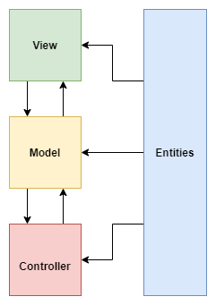

# Mentoria DTI
Git da Bia e do Pertence 

 

### Objetivos: 
1. Melhorar as soft skills para o desenvolvimento de software.

2. Aprender alguns conceitos bases da orientação a objetos, como:
   
          * Classe;
          * Encapsulamento;
          * Herança;
          * Compasição;
          * Agregação.
   
3. Os 4 pilares da orientação a objeto:
   
          * Abstração;
          * Encapsulamento;
          * Herança;
          * Polimorfismo
   
4. Aprender os concitos do Clean code.

5. Aprender os concitos do SOLID.

# Projeto

###  Sistema Desenvolvido:
Será desenvolvido um sistema em JAVA para cadastrar músicas e álbuns com as seguintes funcionalidades:

        * Cadastrar álbum
        * Pesquisar álbum
        * Pesquisar música
        * Gerar playlist
    
###  Arquitetura Desejada - MVC:

